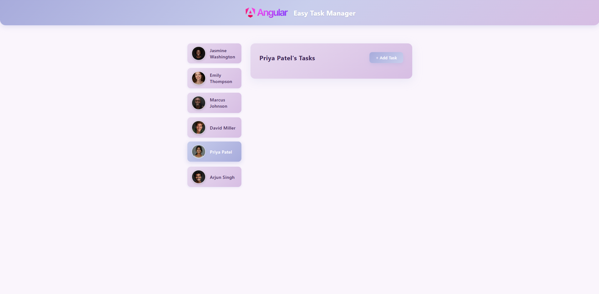
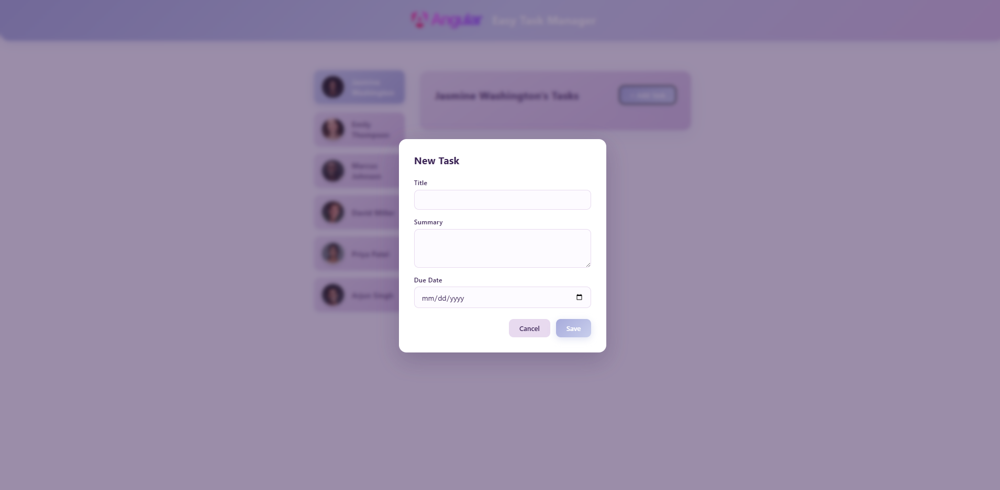
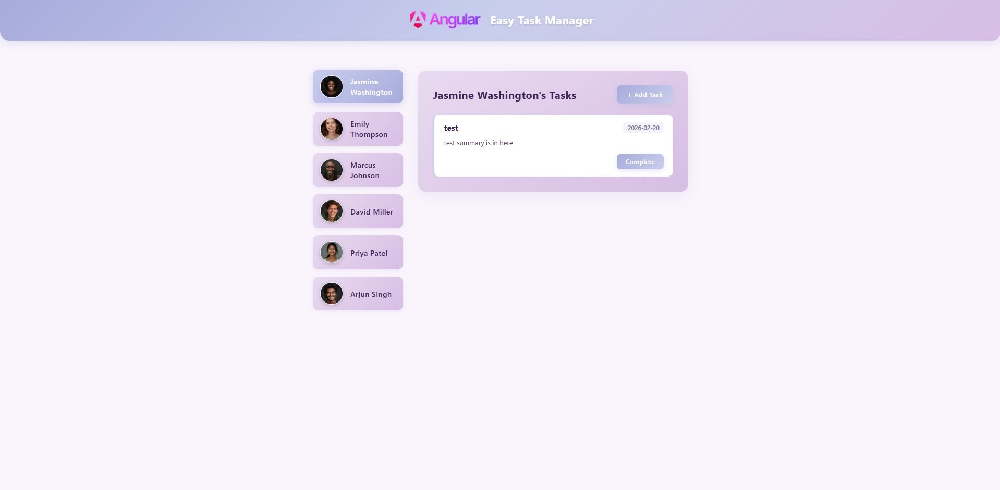

# Easy Task Manager

A simple task management application built with **Angular 21**, showcasing modern Angular features including signals, standalone components, the new input/output API, and built-in control flow syntax.

## Screenshots

### Main View — User Selection & Task Panel



Select a user from the sidebar to view their tasks. The selected user is visually highlighted, and their task panel appears on the right.

### New Task Dialog



Click the **"+ Add Task"** button to open a modal dialog where you can create a new task with a title, summary, and due date.

### Task Card with Actions



Each task is displayed as a card showing its title, summary, and due date. Click **"Complete"** to remove the task. All tasks are persisted in `localStorage`.

---

## Project Structure

```
src/
├── main.ts                         # Application bootstrap
├── dummy-user.ts                   # Static user data
├── dummy-tasks.ts                  # Sample task data (reference)
├── styles.css                      # Global styles
└── app/
    ├── app.ts                      # Root component
    ├── app.html                    # Root template
    ├── app.css                     # Root styles
    ├── app.config.ts               # App configuration
    ├── app.routes.ts               # Route definitions
    ├── header/
    │   ├── header.ts               # Header component
    │   ├── header.html
    │   └── header.css
    ├── user/
    │   ├── user.ts                 # User card component
    │   ├── user.html
    │   ├── user.css
    │   └── user.model.ts           # UserType interface
    └── tasks/
        ├── tasks.ts                # Tasks container component
        ├── tasks.html
        ├── tasks.css
        ├── tasks.service.ts        # Task state management service
        ├── task/
        │   ├── task.ts             # Single task card component
        │   ├── task.html
        │   ├── task.css
        │   └── task.model.ts       # TaskType interface
        └── new-task/
            ├── new-task.ts         # New task modal component
            ├── new-task.html
            └── new-task.css
```

---

## Angular Features & Where They Are Used

### Standalone Components

All components in this project are **standalone** — no `NgModule` is used. Components declare their dependencies directly via the `imports` array in the `@Component` decorator.

| Component | Imports |
|-----------|---------|
| `App` | `CommonModule`, `Header`, `User`, `Tasks` |
| `Tasks` | `Task`, `NewTask` |
| `NewTask` | `FormsModule` |
| `User`, `Header`, `Task` | None (no dependencies) |

### Signals (`signal`, `computed`, `effect`)

Angular's reactive primitive for state management, replacing traditional property binding with fine-grained reactivity.

| Location | Signal | Purpose |
|----------|--------|---------|
| `App` | `title = signal(...)` | Application title |
| `App` | `selectedUser = signal<UserType \| undefined>(...)` | Currently selected user |
| `Tasks` | `isAddingTask = signal(false)` | Toggle new-task modal visibility |
| `Tasks` | `tasks = computed(...)` | Derived list of tasks for the selected user |
| `TasksService` | `tasks = signal<TaskType[]>(...)` | Central task state (source of truth) |
| `TasksService` | `effect(...)` | Auto-sync task state to `localStorage` on every change |

### Input / Output API (`input()`, `output()`)

The modern function-based API replaces `@Input()` and `@Output()` decorators with type-safe, signal-based alternatives.

| Component | Inputs | Outputs |
|-----------|--------|---------|
| `User` | `avatar`, `name`, `id` (required), `selected` (optional) | `userSelected: output<string>()` |
| `Task` | `task` (required) | `taskCompleted: output<string>()` |
| `Tasks` | `user` (required) | — |
| `NewTask` | — | `cancel: output<void>()`, `save: output<{...}>()` |

### Dependency Injection (`inject()`)

The `inject()` function is used instead of constructor-based injection for a cleaner, more concise syntax.

```
// tasks.ts
private tasksService = inject(TasksService);
```

### Built-in Control Flow (`@for`, `@if`)

The new template control flow syntax replaces structural directives (`*ngFor`, `*ngIf`).

| Template | Syntax | Purpose |
|----------|--------|---------|
| `app.html` | `@for (user of users; track user.id)` | Render user list |
| `app.html` | `@if (selectedUser())` | Conditionally show task panel |
| `tasks.html` | `@for (task of tasks(); track task.id)` | Render task cards |
| `tasks.html` | `@if (isAddingTask())` | Conditionally show new-task modal |

### Template-Driven Forms (`FormsModule`, `ngModel`)

Two-way data binding with `[(ngModel)]` is used in the `NewTask` component for form fields.

```
// new-task.html
<input [(ngModel)]="enteredTitle" />
<textarea [(ngModel)]="enteredSummary"></textarea>
<input type="date" [(ngModel)]="enteredDueDate" />
```

### Property & Event Binding

| Binding Type | Examples | Location |
|--------------|----------|----------|
| Property `[...]` | `[src]`, `[alt]`, `[class.selected]`, `[task]`, `[user]` | `user.html`, `app.html`, `tasks.html` |
| Event `(...)` | `(click)`, `(ngSubmit)`, `(userSelected)`, `(taskCompleted)` | Throughout all templates |
| Interpolation `{{ }}` | `{{ name() }}`, `{{ task().title }}`, `{{ user().name }}` | `user.html`, `task.html`, `tasks.html` |

### Injectable Service (`@Injectable`)

`TasksService` is provided at root level (`providedIn: 'root'`), making it a singleton shared across the app.

**Key behaviors:**
- Loads tasks from `localStorage` on initialization
- Exposes `getUserTasks()`, `addTask()`, and `completeTask()` methods
- Uses `signal.update()` for immutable state updates
- Uses `effect()` to automatically persist state changes to `localStorage`

### TypeScript Interfaces

| Interface | File | Properties |
|-----------|------|------------|
| `UserType` | `user/user.model.ts` | `id`, `name`, `avatar` |
| `TaskType` | `task/task.model.ts` | `id`, `userId`, `title`, `summary`, `dueDate` |

### Simplified File Naming (Angular 21)

This project follows the Angular 21 convention of simplified file names:

- `app.ts` instead of `app.component.ts`
- `header.ts` instead of `header.component.ts`
- `styleUrl` (singular) instead of `styleUrls` (array)

---

## Component Communication Flow

```
App
├── Header                          (static, no data flow)
├── User[]                          (receives user data via inputs)
│   └── emits userSelected ──────► App.onUserSelected()
│                                     └── sets selectedUser signal
└── Tasks                           (receives selected user via input)
    ├── Task[]                      (receives task via input)
    │   └── emits taskCompleted ──► TasksService.completeTask()
    └── NewTask                     (modal dialog)
        ├── emits save ───────────► TasksService.addTask()
        └── emits cancel ─────────► Tasks.onCancelAddTask()
```

---

## Getting Started

### Prerequisites

- **Node.js** 20+
- **Angular CLI** 21+

### Installation

```bash
git clone <repository-url>
cd first-angular-app
npm install
```

### Development Server

```bash
ng serve
```

Navigate to `http://localhost:4200/`. The app reloads automatically on file changes.

### Build

```bash
ng build
```

Build artifacts are stored in the `dist/` directory.

### Tests

```bash
ng test
```

Unit tests run with [Vitest](https://vitest.dev/).

---

## Tech Stack

| Technology | Version |
|------------|---------|
| Angular | 21.0.0 |
| TypeScript | 5.9.2 |
| RxJS | 7.8.x |
| Vitest | 4.0.x |
| Zone.js | 0.16.x |
